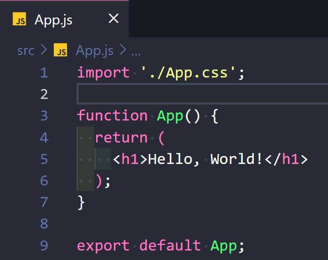
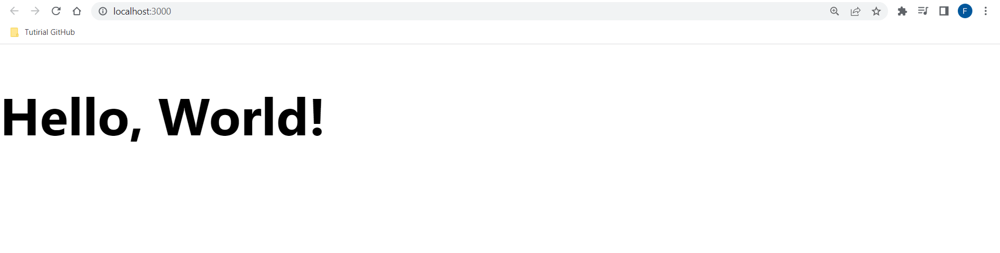
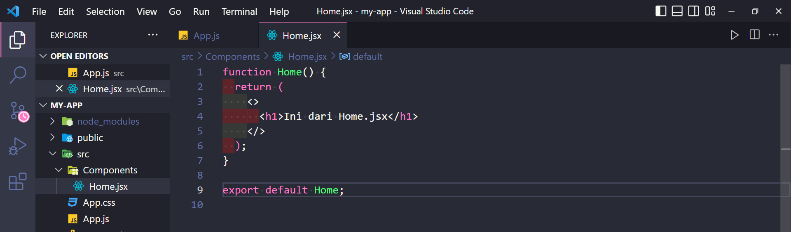
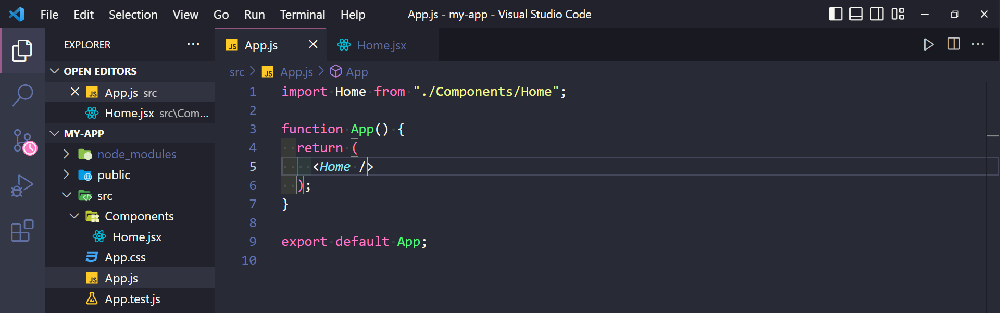
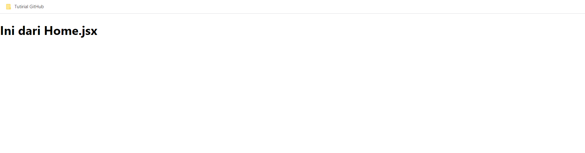
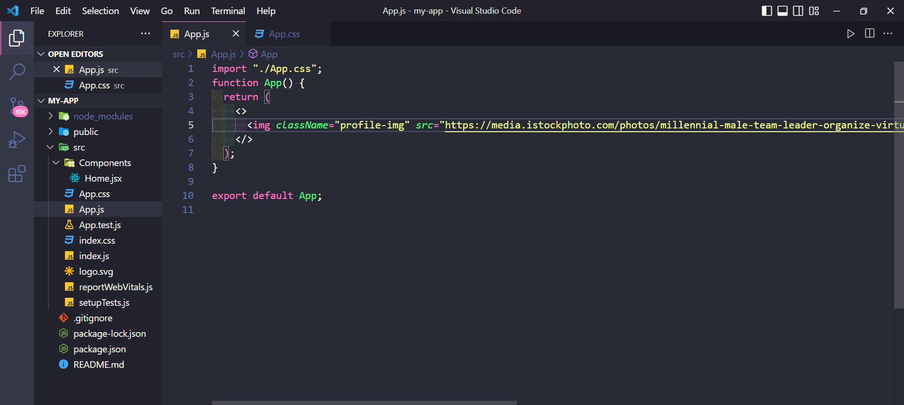
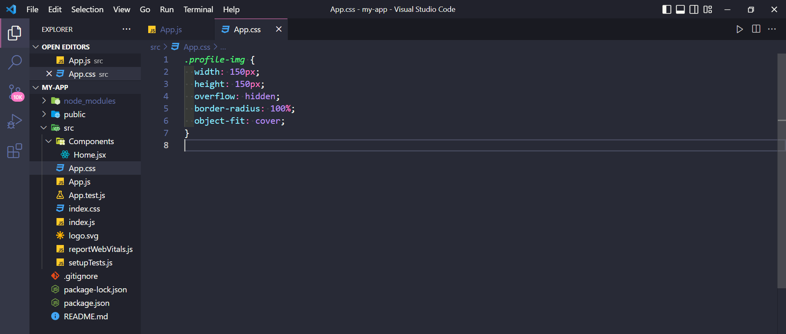
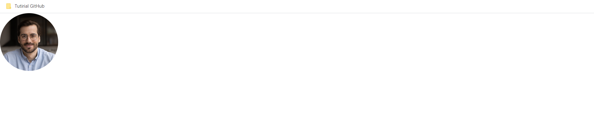
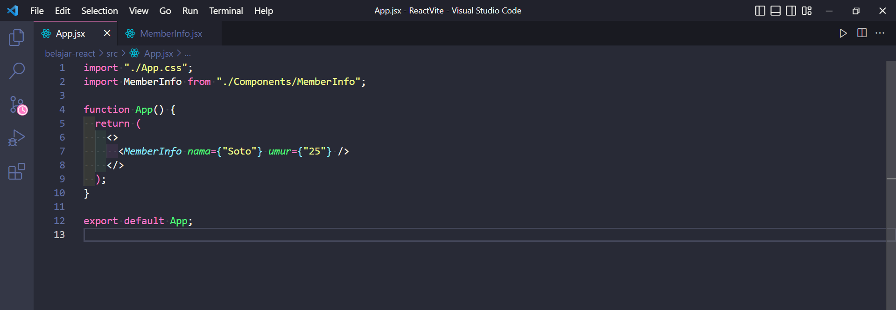
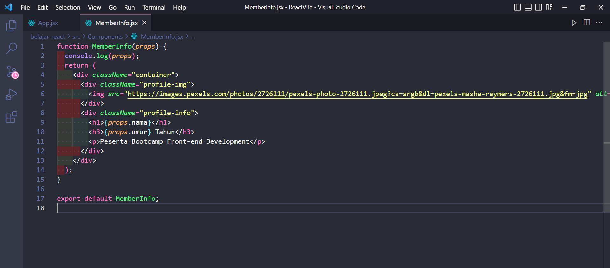

# Front-end Bootcamp Week 1 : React JS

- ## JavaScript for React.js

  React JS adalah library JavaScript yang biasa digunakan saat membangun UI (User Interface) suatu website atau aplikasi web. Dengan menggunakan React JS, proses coding kita akan menjadi lebih efisien. React JS bersifat open source dan React JS hanya mengurusi semua hal yang berkaitan dengan tampilan dan logika di sekitarnya.
  React JS dibuat oleh tim Engginer Facebook dan menggunakannya untuk sisi front-end websitenya. Menurut Google Trends, React masih unggul daripada library js lainnya seperti Vue.js, dll.
  React JS sudah banyak digunakan oleh perusahaan-perusahaan besar seperti Facebook, Netflix, Instagram, dll.

  - Beberapa fitur yang ditawarkan oleh React <br>

    1. Decalarative <br>
       Artinya adalah React dapat membuat UI yang interaktif, sehingga dapat dengan mudah membuat desain yang simple untuk setiap state di dalam aplikasi. Declarative views dapat membuat kode lebih mudah untuk di prediksi dan lebih mudah untuk di debug.
    2. Component – Based <br>
       Dapat membuat Encapsulated Component yang dapat mengatur setiap tahapannya, lalu dapat membuat complex UIs berdasarkan kemampuan itu.
    3. Learn Once, Write Anywhere <br>
       Developer dapat men-develop fitur baru menggunakan react tanpa mengubah kode sebelumnya, react juga dapat bekerja menggunakan Node JS dan mobile apps menggunakan React Native.

  - Mengapa harus menggunakan React Js? <br>

    1. React JS is Fast <br>
       Dapat membuat aplikasi front-end menjadi lebih cepat walaupun harus mengelola berbagai data.
    2. React JS is Modular <br>
       Dapat menerapkan konsep Modular Js pada React JS. React JS membagi 1 tampilan pada website menjadi komponen-komponen kecil.
    3. React JS is Scalable <br>
       Dapat digunakan untuk project/aplikasi berskal kecil hingga besar dan kompleks.
    4. React JS is Popular <br>
       Kita dapat dengan mudah menemukan solusi jika mendapatkan masalah karena komunitas React yang sangat besar.

  - Instalasi React JS <br>

    1. Install Node JS, [buka disini](https://nodejs.org/en/)<br>
    2. Buka browser, ketikkan create-react-app : [buka disini](https://create-react-app.dev/), lalu klik CTA button Get Started <br>
    3. Buat folder yang akan menampung instalasi Reactnya (**Optional**) <br>
    4. Buka git bash, dan jalankan beberapa perintah berikut : <br>
    5. `npx create-react-app my-app` untuk membuat instalasi React <br>
    6. `code .` untuk beralih ke VS Code <br>
    7. `cd my-app` untuk beralih ke my-app <br>
    8. `npm start` untuk menampilkan hasil codingan kita ke browser <br>

  - Struktur React JS <br>
    Terdapat 3 folder yang ada di dalam installan React JS, yaitu :

    1. **node_modules** yang berisi module dan package yang digunakan untuk membuat aplikasi React,
    2. **public** yang merupakan struktur utama dari web kita dimana disitu terdapat index.html, dan
    3. **src** yang merupakan tempat dimana kita akan membuat membuat **Components** yang dibutuhkan untuk website yang akan kita buat.

  - Membuat Tampilan Website dengan React <br>
    Buka file App.js yang ada di folder **src** dan masukkan code berikut : <br>
    
    Buka terminal dan ketikkan command `npm start`, maka hasilnya adalah sebagai berikut : <br>
    
    Kita bisa memasukkan tag HTML ke dalam file JavaScript karena itu merupakan kelebihan dari JSX. <br>
    JSX memiliki peraturan, antara lain adalah : <br>

    1. Setiap file JSX hanya bisa memiliki 1 parent utama, bisa menggunakan `<div>` atau dengan fragment `<></>`

  - Virtual DOM <br>
    Virtual DOM merupakan fitur dari React JS yang merupakan duplikasi dari Real DOM yang sebenarnya.
    Virtual DOM memiliki performa yang lebih cepat daripada real DOM.

  - Beberapa catatan penting <br>

    1. Untuk membuat class untuk HTML, kita bisa menggunakan `className`. <br>
    2. Kegunaan Curly Braces : Kita bisa memasukkan syntax JavaScript, akses variable, event, dll.

<br><br><br>

- ## Components React
  Component adalah bagian-bagian kecil UI dari suatu website yang bisa digunakan kembali dengan memanggilnya. Component dibuat jika component tersebut bersifat reusable code, jadi kita harus membuat component yang kemungkinan akan dibutuhkan di dalam beberapa page seperti navbar, card, dll.
  - Membuat Component <br>
    1. Buat folder Components di dalam folder **src** <br>
    2. Buat file baru dengan extensi **.jsx** <br>
    3. Buka file tersebut, ada 2 cara membuat suatu component, yaitu dengan function dan class, kita akan menggunakan function. Perlu diingat, untuk nama Component, file dan function harus diawali dengan huruf kapital <br>
    4. Export component tersebut dengan menggunakan `export default NamaFunction` <br>
    5. Import component tersebut di dalam file App.js <br>
    6. Untuk menngguakan component, kita bisa memanggil namanya. Contohnya kita memiliki nama component **Home**, kita bisa menggilnya dengan `<Home />` <br>
       <!-- ini adalah Home.jsx -->
       
       <!-- ini adalah App.js -->
       
       <!-- ini adalah tampilan pada browser -->
       

<br><br><br>

- ## Styling pada React

  Masukkan code berikut ke dalam file App.js, buat tag `img` dengan className-nya _profile.img_, jangan lupa import terlebih dahulu file App.css yang akan digunakan untuk memberikan style pada website kita. <br>
   <br>
  Selanjutnya lakukan styling seperti biasa dengan CSS <br>
   <br>
  Maka hasilnya akan seperti berikut <br>
   <br>
  Jika ingin memberikan style secara inline, maka property harus menggunakan camel case, contonya : `backgroundColor` <br>

<br><br><br>

- ## Props dan State

  - Props <br>
    Props adalah Property yang dijadikan sebuah parameter di dalam suatu fungsi. Props biasanya digunakan untuk komunikasi antara parent dan child, komunikasi yang dimaksud adalah pengiriman data. <br>
  - State <br>
    State adalah Object yang digunakan untuk menyimpan data di dalam React JS. Setelah itu akan di render dan jika kita melakukan perubahan pada data. State juga bisa disebut sebagai enkapsulasi.<br>
    State akan mengirim data melalui props agar bisa ditangkap oleh function. <br>
  - Contoh props dan state <br>
    - State <br>
      Disini kita akan mengirim data untuk nama dan umur peserta dengan menggunakan state <br>
      
    - Props <br>
      Disini kita akan menangkap data dengan menggunakan props <br>
      
    - Stateless dan Statefull Component<br>
      - Stateless <br>
        Stateless Component adalah Component yang tidak memiliki State. <br>
      - Statefull <br>
        Statefull Component adalah Component yang memiliki State. <br>

<br><br><br>

- ## Handling Events dan Conditional Rendering

  - Handling Events <br>
    Handling Events di dalam React sama saja dengan Handling Events di dalam DOM Javascript. Biasanya ditulis dengan camelCase, contohnya adalah `onClick`. Cara penulisan Handling Events di React bukan menggunakan string, tetapi dimasukkan ke dalam kurung keriting, contohnya : <br>
    ```html
    <button onClick="{increment}">+</button>
    ```
    <br>
  - Conditional Rendering <br>
    Conditional Rendering bekerja seperti halnya conditionanl di dalam Vanilla Js. Bisa menggunakan operator conditional seperti if, else, && atau dengan ternary operator yang digunakan untuk mengevaluasi sebuha state untuk menentukan component mana yang akan di render. Contohnya :
    <br>

    ```javascript
    function App() {
      const [isLogin, setIsLogin] = useState(false);

      return (
        <>
          {/* tombol login */}
          {/* <button onClick={() => setIsLogin(true)}>Login</button> */}

          {/* Jika user sudah login, maka tombol akan hilang */}
          {!isLogin && <button onClick={() => setIsLogin(true)}>Login</button>}

          {/* User harus login terlebih dahulu agar bisa akses Counter dan ListUser*/}
          {isLogin ? <Counter /> : <p>Login dulu baru bisa akses Counter</p>}
          {isLogin && <ListUser />}
        </>
      );
    }
    ```

    <br>

<br><br><br>

- ## Lifecycle Methods dan Hooks

  - Lifecycle Methods <br>
    Terdapat 3 lifecycle dalam React, yaitu **Mount**, **Update**, dan **Unmount**. <br>
     <br>
    Contoh dari Mount adalah skeleton loading, update adalah proses menampilkan data dari skeleton loading tersebut. <br>
    lifeCycle yang ada di dalam Hooks hanya menggunakan useEffect untuk menyatukan **componentDidMount**, **componentDidUpdate**, dan **componentWillUnmount**. <br>
    Terdapat efek samping dari lifecycle dalam React, seperti kita bisa membuat kita menenakan suatu tombol maka akan timbul suatu perubahan yang terjadi pada tampilan website. <br>
    Efek samping ini misalnya adalah useeffect. <br>
  - Hooks <br>
    Hooks adalah fitur baru yang dikenalkan React JS pada tahun 2018. Hooks memudahkan penggunaan functional components agar bisa menggunakan state dan lifecycle lainnya. <br>
    Hooks yang sering digunakan adalah useState dan useEffect. <br>

    - Perbedaan functional component dan class component <br>
      Dengan mengunakan functonal component, maka code yang kita ketikkan akan lebih pendek, clean dan mudah dimengerti. Banyak yang merekomendasikan penggunaan functional component daripada class component.
    - useState <br>
      Cara penulisannya : <br>

      ```javascript
      const [name, setName] = useState(initialValue);
      ```

      <br>
      Cara penggunaan useState : <br>
      1. Import useState dari react <br>
      2. Tuliskan syntax useState <br>
      3. Tampilkan data dengan `nama` <br>
      4. Update data dengan `setNama` <br>

      useState biasanya digunakan ketika akan menyimpan data suatu form yang nantinya akan dipost ke API untuk di proses. <br>
      Case lainnya adalah saat kita akan melakukan call API, kita bisa menyimpan data hasil `get` dari API ke dalam state dengan menggunakan useState. <br>

    - useEffect <br>
      useEffect merupakan Hooks yang bisa digunakan untuk menggunakan lifecycle pada functional component dengan mudah. <br>
      Penggunaan useEffect dimasukkan sebelum melakukan rendering dan biasanya ditempatkan di bawah useState. <br>
      Cara penggunaan useEffect : <br>
      1. Import useEffect dari react <br>
      2. Tuliskan syntax useState sebelum render<br>
         useEffect biasanya akan digunakan saat akan membuat suatu call API, karena API akan selalu dipanggil sata komponen terbentuk, maka call API bisa di lakukan di dalam useEffect. <br>

  - Beberapa Tips <br>
    Jika terjadi infnity re-render maka tambahan array kosong ([]) di akhiran useEffect <br>
    Hooks harus selalu dipanggil di bagian atas component, biasanya setelah pembuatan functional component. Hal ini juga berlaku untuk useState dan useEffect.

<br><br><br>

- ## Form

  - Cara penulisan `form` di React <br>
    ```html
    <form>
      <label>
        Name:
        <input type="text" name="name" />
      </label>
      <input type="submit" value="Submit" />
    </form>
    ```
